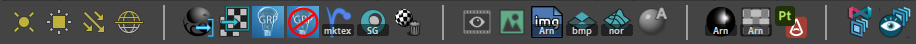
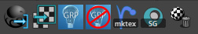
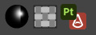

# Maya Project template
Zip file containing Maya project folders for an animation studio pipeline. See [docs](https://docs.sharktacos.com/pipeline/naming.html) for details on organization and naming conventions.

# Maya Turntable Setup 

Maya files for look development turntable setup.
Includes a .json file that can be used to import the following LPEs that create custom AOVs combining two or more builtin AOVs. The following LPEs are included:

| *LPE name* | *LPE code* | *Builtin AOVs*
|----|----|----
| "LPE_texture" | `C[DV]A` | diffuse_albedo + sss_albedo
| "LPE_direct" | `C[D]L` | diffuse_direct + sss_direct
| "LPE_indirect" | `C[TD][DSVOB].*` | diffuse_indirect + sss_indirect 
| "LPE_reflect" | `C<RS>[DSVOB].*` | specular_indirect + coat_indirect + sheen_indirect
| "LPE_spec" | `C<RS>L` | specular_direct + coat_direct + sheen_direct

# Maya scripts

Python and Mel scripts. Place these in your Maya scripts folder. Python scripts updated for Python3 used by Maya 2022. These scripts are also included as buttons in the Maya shelf.

# Maya shelf

A Maya shelf containing the above scripts and some other goodies. This goes in your Maya prefs folder. 

| **OS** | **Location**
|----|----
| Windows: | %USERPROFILE%\Documents\maya\2022\prefs\
| Mac OS X: |  /Users/[username]/Library/Preferences/Autodesk/maya/2022/prefs/
| School Z drive | Z:\maya\2022\prefs\

Shelf items shown above are oranized into the following sections:

## Lights
 
 
 
   - *custom point light* 
     This creates a point light with a templated sphere showing the size (radius) of the light.
   - *custom area light (Arnold)*
   - *custom directional light*
   - *custom dome light (Arnold)*
 
## Scripts
 
  
  
   - *Material Transfer GUI* 
     Used to transfer shader assignments from a lookdev asset to its corresponding Alembic cache. [Watch a video](https://vimeo.com/252241167) showing the use of this GUI. 
   - *UV Transfer GUI*
   - *Create Light Group AOVs* 
    converts the custom LPEs (provided in the .json file described above) to Light Groups.
   - *Remove Light Group AOVs*
   - *Rename Shading Groups on selected objects* For selected objects, renames the shading group to the material name +SG. So if the material is called "wood" the Shading Group will be named "woodSG"
   - *Delete Unused Shading Nodes*
     
  
## Arnold

 
 
   - *Arnold Render View*
   - *Create Maya Texture File Node*
   - *Create aiImage*
   - *Create aiBump*
   - *Create aiNormal*
   - *Create Arnold Standard Shader*
   
## Shader Networks

 
 
   - *Blend Roughness* 
     Two roughness values based on masked regions.
   - *Cloth Shader Network* 
      See [docs](https://docs.sharktacos.com/texture/FabricArnold.html) for more detail. Defaults to plain weave but pattern can be swapped out with maps provided in docs [download](https://docs.sharktacos.com/images/tutorials/Assets/Maya/fabricMaps.zip)
   - *Substance to Maya* 
      Automatic creation of shader networks and textures from Substance 3D Painter. See the [dedicated page](substancePaintertoMaya.md) for details.

## USD

 
 
   - *USD MaterialX Asset Builder* 
     Creates USD lookdev asset with MaterialX shaders.  See [video](https://www.youtube.com/watch?v=bvgdcRC7CuY&t=14s) for details.
   - *USD Viewer* View USD scenes

   
   
