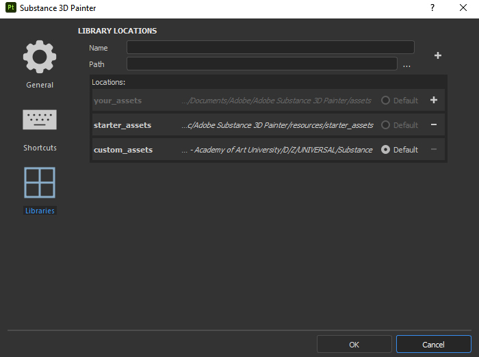

<h2>Installation</h2>

Each folder here goes in its parallel folder in your Substance user shelf or assets folder: 

| Platform	| Version	      | Path
|-----------|---------------|---------------------------------------------------------------
| Windows	  | 7.2 or newer	| C:\Users\username\Documents\Adobe\Adobe Substance 3D Painter\assets\
|           |  Legacy	      | C:\Users\username\Documents\Allegorithmic\Substance Painter\shelf\
| Mac	      | 7.2 or newer	| /Users/username/Documents/Adobe/Adobe Substance 3D Painter/assets/
|           | Legacy	      |/Users/username/Documents/Allegorithmic/Substance Painter/shelf/

Alternately a custom location for assets can be defined in `edit>settings>libraries`.

<h2>Usage</h2>
Watch a <a href="https://vimeo.com/469364354">video walkthrough</a> of the tools and how they are used to optimze your workflow. 

UPDATE: The *Blending Mask* channel used to export masks has been depreciated in SP. Instead you can export masks by right-clicking the mask and choosing "export mask to file" in the context menu. As of version 7.2 (Adobe Substance 3D Painter) this also works for UDIMs.   

