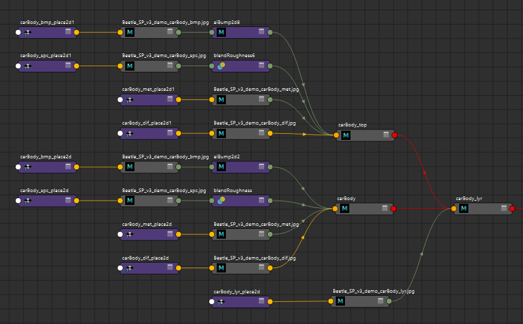

# Substance 3D Painter

## Installation

Each folder here goes in its parallel folder in your Substance user shelf or assets folder: 

| Platform	| Version	      | Path
|-----------|---------------|---------------------------------------------------------------
| Windows	  | 7.2 or newer	| C:\Users\username\Documents\Adobe\Adobe Substance 3D Painter\assets\
|           |  Legacy	      | C:\Users\username\Documents\Allegorithmic\Substance Painter\shelf\
| Mac	      | 7.2 or newer	| /Users/username/Documents/Adobe/Adobe Substance 3D Painter/assets/
|           | Legacy	      |/Users/username/Documents/Allegorithmic/Substance Painter/shelf/

Alternately a custom location for assets can be defined in `edit>settings>libraries`.

## Usage

When starting a project, select the latest version **DF template**. This will load in all the tools and settings. 

Begin by applying the **uber-shader** to all your texture assets. This is a Smart Material which rather than having a set look is instead intended to provide a starting place to create your own textures. Its strucure mirrors that of a BRDF shader such as the aiStandard or PxrSurface shaders. See the video below for a walk through of all of its features.

To output textures use the **DF output template**. This will write out color, bump, metalness, and specular roughness masks (using the user0 channel for the mask).

If you have other masks, such as a layer mask, you can output these manually by right-clicking the mask in the layers panel and selecting "Export mask to file" from the context menu.

Watch a <a href="https://vimeo.com/469364354">video walkthrough</a> of the tools and how they are used to optimze your workflow. 

<iframe src="https://player.vimeo.com/video/469364354?h=089d22b5cd&amp;badge=0&amp;autopause=0&amp;player_id=0&amp;app_id=58479" frameborder="0" allow="autoplay; fullscreen; picture-in-picture" allowfullscreen style="position:absolute;top:0;left:0;width:100%;height:100%;" title="Substance Template (3 of 3)"></iframe>

To import the textures into Maya see my [substancePaintertoMaya.md](Substance to Maya Bridge).

## Userful Hotkeys

| shortcut | Description 
|----|----
| ctr+alt+right | Pick mesh (aka TextureSet)
| shift+right | Rotate Enviornment Lighting
| tab | Fullscreen (hide UI)
| alt+mask icon | show mask (alt click on mask icon)
| M | show material view
| TOOLS: |
| s+click | move **stencil/projection** tool: rotate (s+left), pan (s+middle), zoom (+right) Projection 
| N | Disable **stencil/projection** tool
| [  ] | **brush** size (same as Photoshop)
| ctr+left | **brush** flow (similar to opacity)
| D | Lazy mouse **brush**
| V+left | set **clone** source

