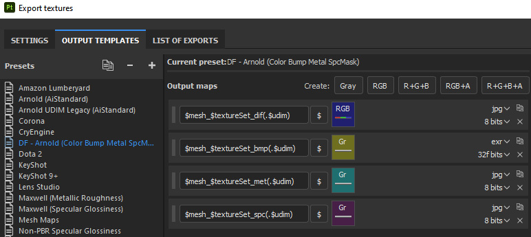
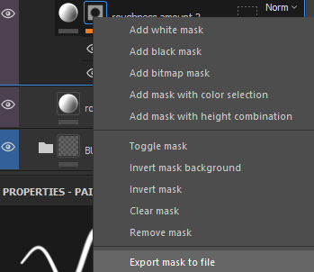

# Substance 3D Painter

## Installation

Each folder here goes in its parallel folder in your Substance user shelf or assets folder: 

| Platform	| Version	      | Path
|-----------|---------------|---------------------------------------------------------------
| Windows	  | 7.2 or newer	| C:\Users\username\Documents\Adobe\Adobe Substance 3D Painter\assets\
|           |  Legacy	      | C:\Users\username\Documents\Allegorithmic\Substance Painter\shelf\
| Mac	      | 7.2 or newer	| /Users/username/Documents/Adobe/Adobe Substance 3D Painter/assets/
|           | Legacy	      |/Users/username/Documents/Allegorithmic/Substance Painter/shelf/

Alternately a custom location for assets can be defined in `edit>settings>libraries`.

## Usage

When starting a project, select the latest version **DF template**. This will load in all the tools and settings. 

Begin by applying the **uber-shader** to all your texture assets. This is a Smart Material which rather than having a set look is instead intended to provide a starting place to create your own textures. Its strucure mirrors that of a BRDF shader such as the aiStandard or PxrSurface shaders. See the video below for a walk through of all of its features.

To output textures use the **DF output template**. This will write out color, bump, metalness, and specular roughness masks (using the user0 channel for the mask).

If you have other masks, such as a layer mask, you can output these manually by right-clicking the mask in the layers panel and selecting "Export mask to file" from the context menu.

Watch a video walkthrough below of the tools and how they are used to optimze your workflow. 

<iframe width="560" height="315" src="https://www.youtube.com/embed/lxKzsIRyML0" title="YouTube video player" frameborder="0" allow="accelerometer; autoplay; clipboard-write; encrypted-media; gyroscope; picture-in-picture; web-share" allowfullscreen></iframe>

To import the textures into Maya see my [Substance to Maya Bridge](substancePaintertoMaya.md).

## Useful Hotkeys

As a bonus, here is a list of hotkeys I use frequently, but always forget. Hense this list!

| shortcut | Description 
|----|----
| ctr+alt+right | Pick mesh (aka TextureSet)
| shift+right | Rotate Enviornment Lighting
| tab | Fullscreen (hide UI)
| alt+mask icon | show mask (alt click on mask icon)
| M | show material view
| TOOLS: |
| s+click | move **stencil/projection** tool: rotate (s+left), pan (s+middle), zoom (+right) Projection 
| N | Disable **stencil/projection** tool
| [  ] | **brush** size (same as Photoshop)
| ctr+left | **brush** flow (similar to opacity)
| D | Lazy mouse **brush**
| V+left | set **clone** source

