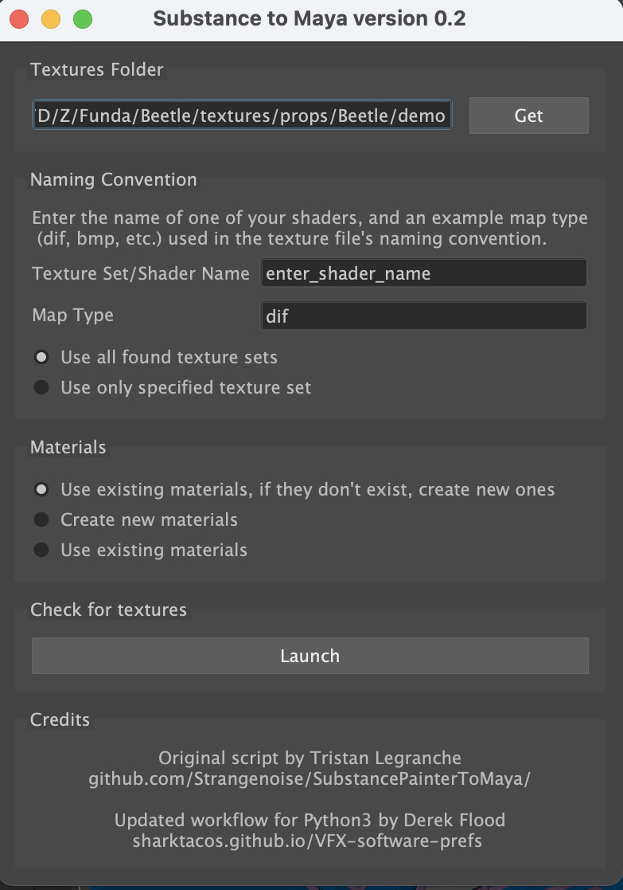
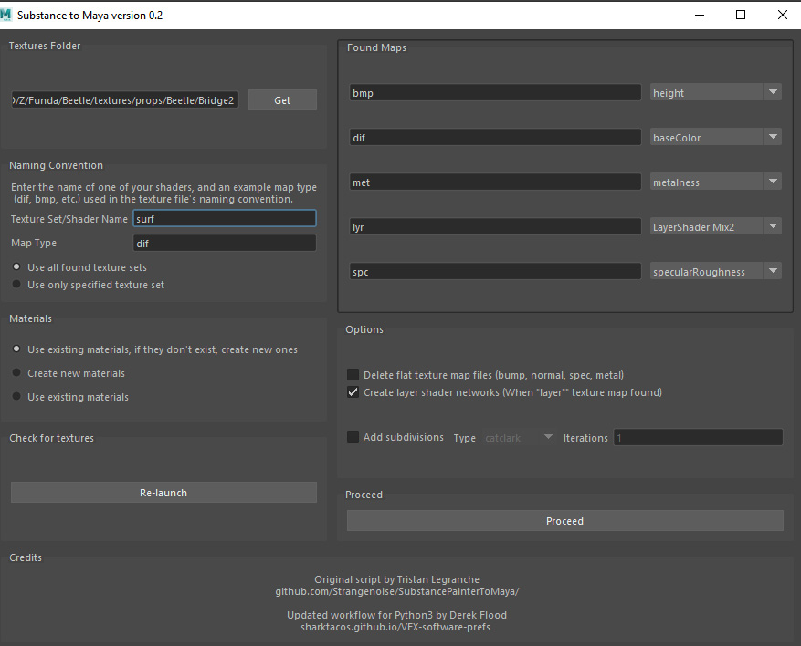
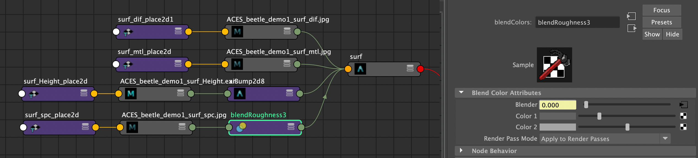
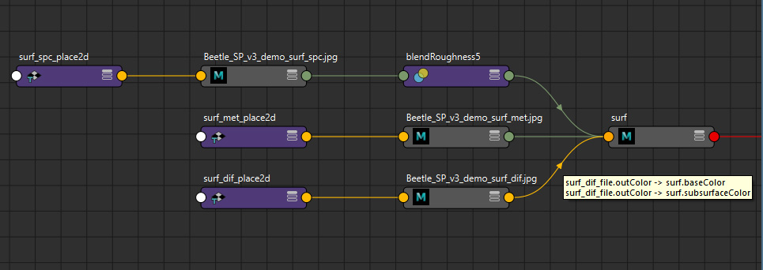
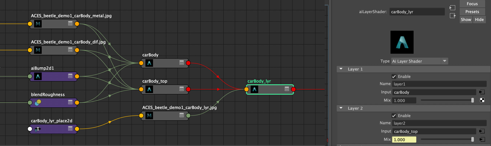

# Substance 3D Painter to Maya (Arnold)

Tool to automatically connect Substance 3D Painter textures to Maya shaders. Based on [the original script by Tristan Le Granche](https://github.com/Strangenoise/SubstancePainterToMaya). This version has been updated for Python 3 (required for Maya 2022 and up). 

## Usage

The script works by parsing the texture maps in a folder based on a defined naming convention, and then assigning these found maps to their corresponding shaders.
For example if we have the following naming for a texture map:

```[assetName]_[shaderName]_[mapType]_[version]_[artist].[ext]```

Example: car_hubcap_bmp_v01_lelgin.exr

There are two parts of this file name we need to identify.

**ShaderName**

This needs to match the name of the shader assigned in Maya. In Substance this is referred to as a "textureSet". That is, the names of the shaders assigned in Maya and exported as an FBX become the "texture sets" when the FBX is imported into Substance Painter. 

**map type**

 The 3 letter code of the texture map type:

| map | name | method 
|----|----|----
| diffuse/base color | dif | export textures
| metalness | met  | export textures
|  bump | bmp  | export textures
| specular roughness | spc, ruf | export mask
| layer mix | lyr | export mask

## Mari, Zbrush, Photoshop 

As long as the names follow this naming convention they can be exported from any program: Photoshop, Mari, or even Zbrush for a normal or displacement map derived from a sculpt. 

| map | name
|----|----
normal | nor 
| displacement | dsp 

Note that only Zbrush can derive a displacement or normal map from a sculpt. Paint programs like substance or Mari cannot because they are not modeling programs. 

## GUI

Click the shelf button to launch the GUI. 



**Texture file location**

*The first field* will default to the texture directory defined in your Maya project settings. If your textures are in a sub folder, you can navigate there. 

**texture set/shader name**

In *the second field* put one of the textureSets (i.e. the shader name) included in your texture's file name. When Substance exports textures it includes the name of the shader you assigned in Maya. The script will match up the shader name in your Maya file to this part of the filename on your texture. 

**map type**

In *the third field* put one of the texture map types you have. Here the "dif" map is selected referring to a diffuse map (base color). 

Click  the "Launch" button and the script will search your textures for matches. This will open the second panel, shown below, where all the texure matches are shown. 



Select the desired options, and click the "Proceed" button. If you have the (default) option "use all found texture sets" the script will assign the texture maps to all the shaders it finds. If you only want to assign textures to one shader use the "use only specified texture set" option.


## Limitations
 - Only the Arnold renderer is supported. I have not had a chance to test this out in Renderman or Vray. Maybe some day.
 - Color Correct mode has been disabled.

## Enhancements

### Specular Roughness mix network
 
As you can see below, in addition to color, bump, normal, and metalness texture maps, specular roughness maps are connected with a blend that allows artists to use the texture as a mask to define regions that are remaped to two roughness sliders (color1 and color2 shown in the Attribute Editor below). This provides artistic control, rather than having the roughness slider locked off with a texture map.



Note that this workflow is also included in the roughness section of my "UberShader" Smartmaterial included in the [Substance tools](Substance.md). The technique is also shown here:

<div style="padding:56.25% 0 0 0;position:relative;"><iframe src="https://player.vimeo.com/video/326948120?h=da9e609785&amp;badge=0&amp;autopause=0&amp;player_id=0&amp;app_id=58479" frameborder="0" allow="autoplay; fullscreen; picture-in-picture" allowfullscreen style="position:absolute;top:0;left:0;width:100%;height:100%;" title="Substance Painter: A better way to export roughness maps for artistic control"></iframe></div><script src="https://player.vimeo.com/api/player.js"></script><br>

### Color maps multiple inputs, and default shader settings

The color map is connected to both the base color and the subsurface color. This allows you to paint one color map in Substance Painter, and saves on disc space as well. Since the subsurface weight on the AiStandardSurface is set to zero by default, if you wish to use sss you just need to turn the subsurface weight on (and the base color weight off).



Additionally the following attributes are set on all the aiStandardSurface shaders, providing an optimal starting place:

- specular weight: 0.5
- transmit AOVs: on
- subsurface radius: 0.15, 0.008, 0.008 (blood red)
- subsurface scale: 0.1
- subsurface anisotropy: 0.8


### Layer Shader network
 
If a layer map is found (naming: 'Layer', 'layer', 'lyr') the aiStandardSurface shader is duplicated with all of its input connections, and these two shaders are then connected to a layerShader. Finally the layer texture map is input into the layer mix. 
 

   


