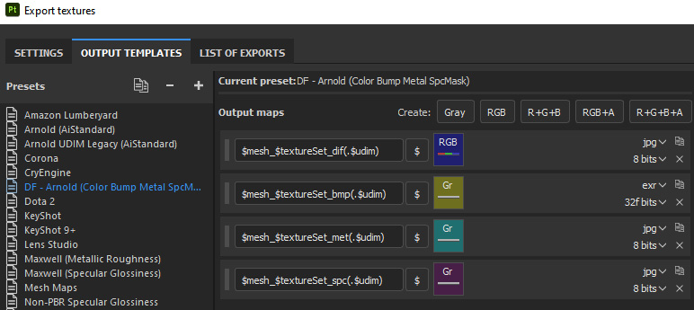
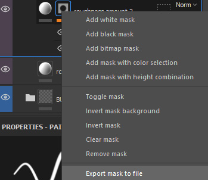
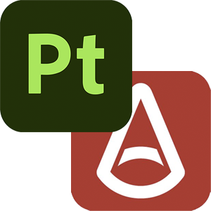

# Substance 3D Painter to Maya (Arnold)

Tool to automatically connect Substance 3D Painter textures to Maya shaders. Based on [the original script by Tristan Le Granche](https://github.com/Strangenoise/SubstancePainterToMaya). This version has been updated for Python 3 (required for Maya 2022 and up). 

Note that as long as the texture maps follow the naming convention described below, they can be exported from any program: Photoshop, Mari, or even Zbrush for a normal or displacement map derived from a sculpt. 

This script is much more sophisticaed than [the one provided by Adobe/Substance](https://substance3d.adobe.com/documentation/integrations/apply-workflow-to-maps-223054251.html) in that it allows you to connect more complex shader networks, such as masked specular roughtness or layer shader networks, as described below. This results in more artistic control.

## Usage

The script works by parsing the texture maps in a folder based on a defined naming convention, and then assigning these found maps to their corresponding shaders.
For example say we have the following naming for a texture map:

```[assetName]_[shaderName]_[mapType]_[version]_[artist].[ext]```

Example: ```car_hubcap_bmp_v01_dflood.exr```

There are two parts of this file name we need to identify.

**ShaderName**

This needs to match the name of the shader assigned in Maya. In Substance this is referred to as a "textureSet". That is, the names of the shaders assigned in Maya and exported as an FBX become the "texture sets" when the FBX is imported into Substance Painter. The texture maps containing this name will be assigned to the shader with the same name. 

**map type**

 The 3 letter code of the texture map type:

| map | name | texture creation method 
|----|----|----
| diffuse/base color | dif | Export Textures "DF - Arnold (Color Bump Metal SpcMask)"
|  bump | bmp  | Export Textures "DF - Arnold (Color Bump Metal SpcMask)"
| metalness | met  | Export Textures "DF - Arnold (Color Bump Metal SpcMask)"
| specular roughness | spc, ruf | Export Textures "DF - Arnold (Color Bump Metal SpcMask)"
| layer mix | lyr | Mask context menu "Export mask to file"

 
 
Color, bump, metalness, and specular roughness masks call all be exported from Substance Painter using the "DF - Arnold (Color Bump Metal SpcMask)" output template included in the [Substance tools](Substance.md).

Layer masks need to be saved manually by right-clicking on the mask in the Layers and selecting "Export Mask to File" from the context menu.


 
 


## Mari, Zbrush, Photoshop 

As long as the names follow this naming convention they can be exported from any program: Photoshop, Mari, or even Zbrush for a normal or displacement map derived from a sculpt. For example here are displacement and normal maps exported from Zbrush: 

| map | name | texture creation method 
|----|----|----
normal | nor | Zbrush: Multi-map exporter
| displacement | dsp | Zbrush: Multi-map exporter


Note that only Zbrush can derive a displacement or normal map from a sculpt. Paint programs like substance or Mari cannot because they are not modeling programs. Substance when it generates a normal map is simply converting a 2D hight map into the normal map format, not deriving it from a 3D sculpt.

## GUI

The script is included in the [custom Maya shelf](Maya.md#maya-shelf).

  

Click the shelf button to launch the GUI. 
 
 

**Texture file location**

*The first field* will default to the texture directory defined in your Maya project settings. If your textures are in a sub folder, you can navigate there. 

**texture set/shader name**

In *the second field* put one of the textureSets (i.e. the shader name) included in your texture's file name. You only need to enter one texture set and the script will find all the others.  

**map type**

In *the third field* put one of the texture map types you have. Here the "dif" map is selected referring to a diffuse map (base color). Assuming you are using the naming convention of "dif" for your diffuse map you can just leave this as is.

Click  the "Launch" button and the script will search your textures for matches. This will open the second panel, shown below, where all the texure matches are listed. 


Select the desired options, and click the "Proceed" button. If you have the (default) option "use all found texture sets" the script will assign the texture maps to all the shaders it finds. If you only want to assign textures to one shader use the "use only specified texture set" option.


## Limitations
 - Only the Arnold renderer is supported (AiStandardSurface and AiLayerShader). I have not had a chance to test this out in Renderman or Vray. Maybe some day, but don't hold your breath.

## Enhancements


### Color maps multiple inputs, and default shader settings

The color map is connected to both the base color and the subsurface color. This allows you to paint one color map in Substance Painter, and saves on disc space as well. Since the subsurface weight on the AiStandardSurface is set to zero by default, if you wish to use sss you just need to turn the subsurface weight on (and the base color weight off).


Additionally the following attributes are set on all the aiStandardSurface shaders, providing an optimal starting place:

- specular weight: 0.5
- transmit AOVs: on
- subsurface radius: 0.15, 0.008, 0.008 (blood red)
- subsurface scale: 0.1
- subsurface anisotropy: 0.8

### Constant Color detection

For a metallness map, Arnold uses the "constant color detect" function of maketx. So if the metallness map is a 2048x2048 solid white texture, instead of storing all those pixels in memory it will instead uses a 64x64 pixel texture. 

### Specular Roughness mask network
 
While color, bump, and metalness texture maps are connected directly to the shader attributes, specular roughness maps are instead made with an alpha mask which is exported through a custom user channel. The black and white values of this mask are then remaped to two roughness sliders (color1 and color2 shown in the Attribute Editor below). This provides artistic control, rather than having the roughness slider locked off with a texture map.


Note that this workflow is also included in the roughness section of my "UberShader" Smart Material included in the [Substance tools](Substance.md). The technique is also demonstrated here:

<div style="padding:56.25% 0 0 0;position:relative;"><iframe src="https://player.vimeo.com/video/326948120?h=da9e609785&amp;badge=0&amp;autopause=0&amp;player_id=0&amp;app_id=58479" frameborder="0" allow="autoplay; fullscreen; picture-in-picture" allowfullscreen style="position:absolute;top:0;left:0;width:100%;height:100%;" title="Substance Painter: A better way to export roughness maps for artistic control"></iframe></div><script src="https://player.vimeo.com/api/player.js"></script><br>

Similar to the constant color detect for metallness maps described above, the script has added functionlaity to  parse the spec texture maps to detect if they are empty (all black pixels) indicating that they were output by Substance Painter, but were not painted. In this case it will skip that texture, not connecting the spec mask network to the roughness slider.

### Layer Shader network option
 
If a layer map is found (naming: 'Layer', 'layer', 'lyr') the aiStandardSurface shader is duplicated with all of its input connections, and these two shaders are then connected to a layerShader. Finally the layer texture map is input into the layer mix. 
 

   


