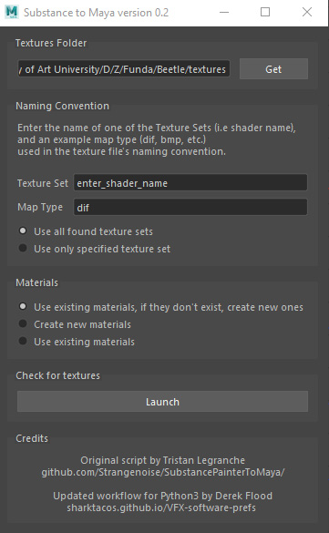
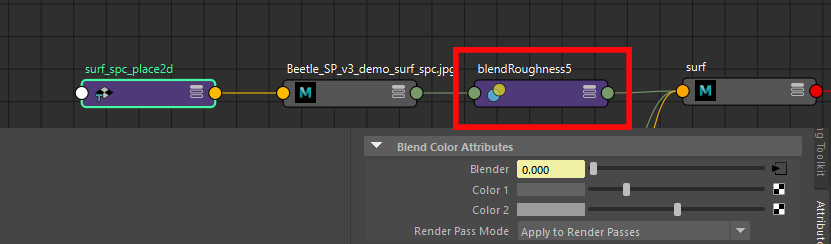

# Sp2M: Substance 3D Painter to Maya (Arnold)

Tool to automatically connect Substance 3D Painter textures to Maya shaders. Based on [the original script by Tristan Le Granche](https://github.com/Strangenoise/SubstancePainterToMaya). This version has been updated for Python 3 (required for Maya 2022 and up), and has added functionlaity described below.

## Naming Convention

The script works by parsing the texture maps in a folder based on a defined naming convention, and then assigning these found maps to their corresponding shaders. For example say we have the following naming for a texture map:

```[assetName]_[shaderName]_[mapType]_[version]_[artist].[ext]```

Example: ```car_hubcap_bmp_v01_dflood.exr```

There are two parts of this file name we need to identify. The shader name and the map type.

**Shader Name**

This needs to match the name of the shader assigned in Maya. In Substance this is referred to as a "textureSet" (called with the $textureSet variable in Output presets). That is, the names of the shaders assigned to a model in Maya become the "texture sets" when the FBX is imported into Substance Painter. The script will find texture maps containing this name and assign these to the shader with the same name in Maya. 

**Map Type Name**

The texture map type name. In the case of our school's naming convention, we use a 3 letter code (dif for diffuse, bmp for bump, and so on). The script recognizes several names for the map type, listed below. Based on these names in the texture file the script will know where to connect the map to the shader in Maya.

| map | name | 
|----|----
| diffuse/base color | '**dif**', 'baseColor', 'BaseColor', 'basecolor', 'color', 'Color','albedo', 'Albedo', 'diffuse', 'Diffuse', 'diff', 'Diff'
|  bump/height | '**bmp**', 'height', 'Height','bump', 'Bump', 'BumpMap', 'bumpMap'
| metalness | '**met**', 'metal', 'Metal', 'metalness', 'Metalness', 'metallic', 'Metallic', 'mtl'
| specular roughness mask | '**spc**', 'ruf', 'roughness', 'Roughness', 'specularRoughness', 'SpecularRoughness', 'specular', 'Specular', 'spec', 'Spec',
| layer mix | '**lyr**', 'Layer', 'layer'
| normal | '**nor**', 'normal', 'Normal', 'normalMap', 'NormalMap', 'nor'
| displacement | '**dsp**', 'displace', 'Displace', 'Displacement', 'displacement', 'displacementMap', 'DisplacementMap', 'disp'


## Exporting Texture Maps 

The exported texture files must contain the *shader name* and *map type* in the texture file name. In Substance Painter this is included in most Output templages through the $textureSet variable (for the shader name). For our recomended workflow we use the  ```DF - Arnold (Color Bump Metal SpcMask)``` Output Template (pictured below) which works in combination with my uber shader Smart Material, which mirrors a standard BRDF shader such as the aiStandardSurface in Arnold. All of these are included in the [Substance tools](Substance.md). This will export out Color, bump, metalness, and specular roughness masks.

 

Layer shader masks are exported manually by right-clicking the mask in the layers panel and selecting "Export mask to file" from the context menu.

 

## Exporting Textures from Other Programs - Mari, Zbrush, Photoshop 

As long as the names follow this naming convention they can be exported from any program: Photoshop, Mari, or even Zbrush for a normal or displacement map derived from a sculpt. For example here are displacement and normal maps exported from Zbrush: 

Note that only Zbrush can derive a displacement or normal map from a sculpt. Paint programs like substance or Mari cannot because they are not modeling programs. Substance when it generates a normal map is simply converting a 2D hight map into the normal map format, not deriving it from a 3D sculpt.


## Using the GUI

The script is included in the [custom Maya shelf](Maya.md#maya-shelf).

  

Click the shelf button to launch the GUI. 
 
 
 
There are three fields we need to look at

1. **Texture file location** This will default to the texture directory defined in your Maya project settings. If your textures are in a sub folder, you can navigate there. 

2. **texture set/shader name** Enter the name of one of the textureSets (i.e. the shader name) included in your texture's file name. You only need to enter one texture set and the script will find all the others.  

3. **map type** In the third field put one of the texture map types you have. Here the "dif" map is selected referring to a diffuse map (base color). Assuming you are using the naming convention of "dif" for your diffuse map you can just leave this as is.

Click  the "Launch" button and the script will search your textures for matches. This will open the second panel, shown below, where all the texure matches are listed. 


Select the desired options, and click the "Proceed" button. If you have the (default) option "use all found texture sets" the script will assign the texture maps to all the shaders it finds. If you only want to assign textures to one shader use the "use only specified texture set" option.


## Limitations
 - Only the Arnold renderer is supported (AiStandardSurface and AiLayerShader). I have not had a chance to test this out in Renderman or Vray. Maybe some day, but don't hold your breath! :)

## Enhancements


### Color maps multiple inputs, and default shader settings

The color map is connected to both the base color and the subsurface color. This allows you to paint one color map in Substance Painter, and saves on disc space as well. Since the subsurface weight on the AiStandardSurface is set to zero by default, if you wish to use sss you just need to turn the subsurface weight on (and the base color weight off).


Additionally the following attributes are set on all the aiStandardSurface shaders, providing an optimal starting place:

- specular weight: 0.5
- transmit AOVs: on
- subsurface radius: 0.15, 0.008, 0.008 (blood red)
- subsurface scale: 0.1
- subsurface anisotropy: 0.8

### Specular Roughness mask network
 
While color, bump, and metalness texture maps are connected directly to the shader attributes, specular roughness maps are instead made with an alpha mask which is exported through a custom user channel. The black and white values of this mask are then remaped to two roughness sliders (color1 and color2 shown in the Attribute Editor below). This provides artistic control, rather than having the roughness slider locked off with a texture map.



Note that this workflow is also included in the roughness section of my "UberShader" Smart Material included in the [Substance tools](Substance.md). The technique is also demonstrated here:

<div style="padding:56.25% 0 0 0;position:relative;"><iframe src="https://player.vimeo.com/video/326948120?h=da9e609785&amp;badge=0&amp;autopause=0&amp;player_id=0&amp;app_id=58479" frameborder="0" allow="autoplay; fullscreen; picture-in-picture" allowfullscreen style="position:absolute;top:0;left:0;width:100%;height:100%;" title="Substance Painter: A better way to export roughness maps for artistic control"></iframe></div><script src="https://player.vimeo.com/api/player.js"></script><br>


### Layer Shader network option
 
If a layer map is found (naming: 'Layer', 'layer', 'lyr') the aiStandardSurface shader is duplicated with all of its input connections, and these two shaders are then connected to a layerShader. Finally the layer texture map is input into the layer mix. 
 


## Detect Flat Color Texture Maps

The script parses the texture maps to detect when an image is a flat solid color, indicating textures output by Substance Painter that were not painted. It will then do the following depending on the texture map type:

- **BaseColor/diffuse and SSS maps** Keep. These are connected, but the mipmap used is only a single tile via the ```--constant-color-detect``` option of maketx.
- **Metalness maps** Substitute value. Will set the slider to the pixel value, rather than connecting the flat texture map.
- **Bump & Normal maps** Skipped. Will not connect the flat texture map, as it will have no effect on the shader.
- **Spec roughness maps** Skipped. Will not connect the flat map and network. Roughness value remains at its default settings.
- **Layer Masks** Skipped. Will not convert the shader to a Layer Shader network.

